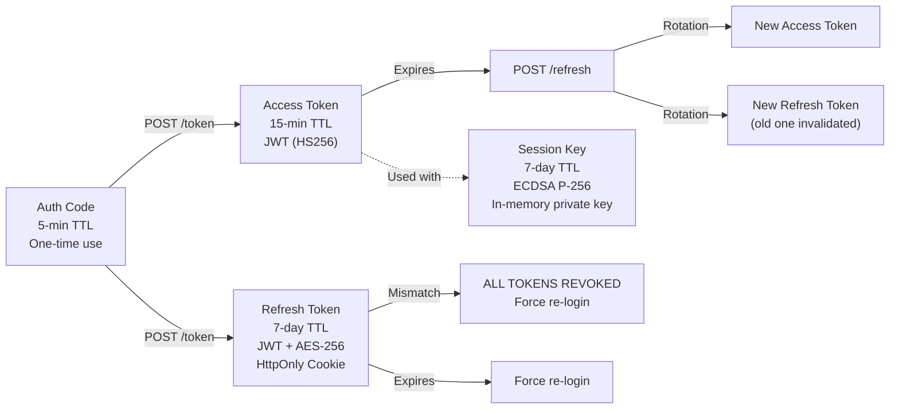

# 🔐 Authentication & Security Architecture — NexusBank Zero Trust Platform

> A comprehensive deep dive into every security layer, cryptographic mechanism, and trust boundary in the system. This document explains not just *what* the system does, but *why* each design decision was made.

---

## Table of Contents

- [Zero Trust Philosophy](#zero-trust-philosophy)
- [Security Layer Stack](#security-layer-stack)
- [Layer 1: Password Authentication](#layer-1-password-authentication)
- [Layer 2: TOTP (Time-Based One-Time Password)](#layer-2-totp)
- [Layer 3: WebAuthn / FIDO2 (Device Binding)](#layer-3-webauthn--fido2)
- [Layer 4: OAuth2 Authorization Code Flow](#layer-4-oauth2-authorization-code-flow)
- [Layer 5: JWT Access Tokens](#layer-5-jwt-access-tokens)
- [Layer 6: Refresh Token Rotation](#layer-6-refresh-token-rotation)
- [Layer 7: Ephemeral ECDSA Session Keys](#layer-7-ephemeral-ecdsa-session-keys)
- [Layer 8: Cryptographic Request Signing](#layer-8-cryptographic-request-signing)
- [Layer 9: Centralized Verification (Policy Enforcement Point)](#layer-9-centralized-verification)
- [Layer 10: Dynamic RBAC with API Mapping](#layer-10-dynamic-rbac-with-api-mapping)
- [Layer 11: Risk Scoring & Auto-Blocking](#layer-11-risk-scoring--auto-blocking)
- [Layer 12: Cookie Security](#layer-12-cookie-security)
- [Layer 13: Audit Logging](#layer-13-audit-logging)
- [Layer 14: Admin Device Revocation](#layer-14-admin-device-revocation)
- [Token Lifecycle](#token-lifecycle)
- [Cryptographic Algorithms Used](#cryptographic-algorithms-used)
- [Database Security Models](#database-security-models)
- [Attack Surface Analysis](#attack-surface-analysis)
- [Comparison with Traditional Architecture](#comparison-with-traditional-architecture)

---

## Zero Trust Philosophy

Traditional security models trust users once they're "inside" the network. Zero Trust rejects this assumption entirely:

> **"Never trust, always verify."**

In this application, that principle is enforced at the deepest level:

1. **Having a valid JWT is not enough** — every request must also carry a cryptographic proof of possession
2. **Being on the corporate network doesn't grant access** — RBAC is checked on every API call
3. **Being authenticated doesn't mean being authorized** — permissions are verified per-endpoint
4. **Past trust doesn't guarantee future trust** — sessions can be revoked, devices can be blocked, risk scores can escalate

---

## Security Layer Stack

```
┌─────────────────────────────────────────────────────────────┐
│                    REQUEST FROM BROWSER                      │
│                                                              │
│  Authorization: Bearer <JWT>                                 │
│  X-Signature: <ECDSA signature of request>                   │
│  X-Timestamp: <unix milliseconds>                            │
│  Cookie: refreshToken=<HttpOnly JWT>                         │
└──────────────────────────┬──────────────────────────────────┘
                           │
                           ▼
┌──────────────────────────────────────────────────────────────┐
│  Layer 1:  Password Verification (bcrypt, 10 salt rounds)    │
│  Layer 2:  TOTP Verification (Google Authenticator)          │
│  Layer 3:  WebAuthn Device Binding (FIDO2, platform auth)    │
│  Layer 4:  OAuth2 Authorization Code (one-time, 5-min TTL)   │
│  Layer 5:  JWT Access Token (15-min, signed with HS256)      │
│  Layer 6:  Refresh Token Rotation (7-day, AES-256 encrypted) │
│  Layer 7:  Ephemeral ECDSA Session Key (P-256, in-memory)    │
│  Layer 8:  Cryptographic Request Signing (per-request ECDSA) │
│  Layer 9:  Centralized Verification (PEP)                    │
│  Layer 10: Dynamic RBAC (role → permissions → API mapping)   │
│  Layer 11: Risk Scoring & Auto-Blocking (threshold: 90)      │
│  Layer 12: Cookie Security (HttpOnly, Secure, SameSite)      │
│  Layer 13: Audit Logging (all auth events tracked)           │
│  Layer 14: Admin Device Revocation (remote session kill)     │
└──────────────────────────────────────────────────────────────┘
```

---

## Layer 1: Password Authentication

**Implementation:** `services/auth/controllers/auth.js` (login, authorize)

| Aspect | Detail |
|--------|--------|
| Hashing | bcrypt with 10 salt rounds |
| Storage | Only the hash is stored in MongoDB |
| Comparison | `bcrypt.compare(plaintext, hash)` — constant-time comparison |
| Brute-Force Protection | Risk score escalation (Layer 11) |

**Why bcrypt?** Unlike MD5/SHA, bcrypt is deliberately slow (~100ms per hash). This makes brute-force attacks computationally infeasible. The 10 salt rounds mean each hash requires ~2^10 iterations.

```javascript
// Registration
const salt = await bcrypt.genSalt(10);
const hashedPassword = await bcrypt.hash(password, salt);

// Login
const isMatch = await bcrypt.compare(password, user.password);
```

---

## Layer 2: TOTP

**Implementation:** `services/auth/controllers/auth.js` (setupAuthenticator, verifyDeviceTotp)

| Aspect | Detail |
|--------|--------|
| Algorithm | TOTP (RFC 6238) via `otplib` |
| Code Length | 6 digits |
| Time Window | 30 seconds |
| Secret Storage | Per-user `authenticatorSecret` field in User document |
| QR Code | Generated with `qrcode` library, scanned by Google Authenticator |

**First-time setup flow:**
1. Server generates a random secret using `authenticator.generateSecret()`
2. Secret is stored on the user document (temporarily unverified)
3. A QR code is generated using `authenticator.keyuri(email, 'ZeroTrustBank', secret)`
4. User scans QR with Google Authenticator
5. User enters the 6-digit code → server verifies with `authenticator.verify()`
6. `isAuthenticatorSetup` is set to `true`

**Why TOTP?** It's a second factor that doesn't rely on SMS (which is vulnerable to SIM swapping) or email (which can be compromised). The secret lives only in the authenticator app.

---

## Layer 3: WebAuthn / FIDO2

**Implementation:** `services/auth/controllers/webauthn.js`

| Aspect | Detail |
|--------|--------|
| Standard | WebAuthn / FIDO2 |
| Library | `@simplewebauthn/server` v13 |
| Authenticator Type | Platform only (`authenticatorAttachment: "platform"`) |
| User Verification | Required (`userVerification: "required"`) |
| Attestation | None (anonymous attestation — we don't need to verify the hardware manufacturer) |
| Challenge Storage | In-memory `Map` with 5-minute TTL (use Redis in production) |
| Counter Verification | Yes — detects cloned authenticators |

### Registration Flow

```
Browser                          Server
   │                                │
   │  POST /webauthn/register-opts  │
   │  { userId }                    │
   ├───────────────────────────────►│
   │                                │  Generate challenge
   │                                │  Store in challengeStore Map
   │  { options, challengeToken }   │
   │◄───────────────────────────────┤
   │                                │
   │  navigator.credentials.create()│
   │  (triggers biometric/PIN)      │
   │                                │
   │  POST /webauthn/register       │
   │  { challengeToken,             │
   │    attestationResponse }       │
   ├───────────────────────────────►│
   │                                │  Verify attestation
   │                                │  Extract public key
   │                                │  Store WebAuthnCredential
   │  { success: true }             │
   │◄───────────────────────────────┤
```

### Authentication Flow

```
Browser                          Server
   │                                │
   │  POST /webauthn/login-opts     │
   │  { userId }                    │
   ├───────────────────────────────►│
   │                                │  Look up user's credentials
   │                                │  Generate challenge
   │  { options, challengeToken }   │
   │◄───────────────────────────────┤
   │                                │
   │  navigator.credentials.get()   │
   │  (triggers biometric/PIN)      │
   │                                │
   │  POST /webauthn/login          │
   │  { challengeToken,             │
   │    assertionResponse }         │
   ├───────────────────────────────►│
   │                                │  Verify assertion signature
   │                                │  Check counter (anti-clone)
   │                                │  Update counter
   │                                │  Issue auth code
   │  { code }                      │
   │◄───────────────────────────────┤
```

**Why platform authenticators only?** By restricting to `platform` authenticators (TPM, Touch ID, Face ID, Windows Hello), we ensure the credential is **hardware-bound**. It can't be moved to another device — not even by the user. This means a stolen laptop without the user's biometric is useless.

---

## Layer 4: OAuth2 Authorization Code Flow

**Implementation:** `services/auth/controllers/auth.js` (authorize, token)

Instead of returning tokens directly from the login page, the system uses a proper authorization code flow:

```
1. User authenticates → Server generates auth code
2. Server redirects: redirect_uri?code=<random-32-char-hex>
3. Frontend exchanges code: POST /api/auth/token { code }
4. Server returns: { accessToken } + Set-Cookie: refreshToken
```

### Auth Code Properties

| Property | Value |
|----------|-------|
| Format | 32 character hex string (`crypto.randomBytes(16)`) |
| TTL | 5 minutes |
| Usage | One-time (deleted after exchange) |
| Storage | `AuthCode` MongoDB collection with TTL index |

**Why not return tokens directly?** The authorization code pattern prevents tokens from appearing in browser history, server logs, or referrer headers. The code is only valid for 5 minutes and can only be used once.

---

## Layer 5: JWT Access Tokens

**Implementation:** `services/auth/controllers/auth.js` (token, refresh)

| Property | Value |
|----------|-------|
| Algorithm | HS256 (HMAC-SHA256) |
| Expiry | 15 minutes |
| Payload | `{ userId, role }` |
| Secret | `JWT_SECRET` environment variable |
| Delivery | JSON response body + stored in `localStorage` |

```javascript
const accessToken = jwt.sign(
  { userId: user._id, role: user.role },
  getJwtSecret(),
  { expiresIn: "15m" }
);
```

**Why 15 minutes?** Short-lived tokens limit the damage window if intercepted. After 15 minutes, the token is useless — the client must use the refresh token to get a new one.

---

## Layer 6: Refresh Token Rotation

**Implementation:** `services/auth/controllers/auth.js` (refresh)

This is one of the most important security mechanisms in the system.

### How It Works

```
Login:
  refreshToken_v1 → encrypted → stored on User document
  refreshToken_v1 → set as HttpOnly cookie

First refresh:
  Client sends refreshToken_v1 (cookie)
  Server verifies: decrypt(user.refreshToken) === refreshToken_v1 ✅
  Server issues refreshToken_v2
  refreshToken_v2 → encrypted → replaces refreshToken_v1 on User document
  refreshToken_v1 is NOW INVALID

Second refresh:
  Client sends refreshToken_v2 (cookie)
  Server verifies: decrypt(user.refreshToken) === refreshToken_v2 ✅
  ... cycle continues ...
```

### Theft Detection

If an attacker steals `refreshToken_v1` and uses it AFTER the legitimate user has already refreshed (getting `refreshToken_v2`):

```
Attacker sends: refreshToken_v1
Server checks: decrypt(user.refreshToken) → refreshToken_v2
Mismatch! refreshToken_v1 ≠ refreshToken_v2

SERVER ACTION:
  user.refreshToken = null  ← REVOKE ALL TOKENS
  Return 401: "Refresh token mismatch. Access revoked."
```

Both the attacker AND the legitimate user are logged out. The legitimate user must go through full MFA again.

### Encryption

Refresh tokens are encrypted before storage using AES-256-CBC:

```javascript
// Encrypt
const iv = crypto.randomBytes(16);
const cipher = crypto.createCipheriv('aes-256-cbc', key, iv);
// Result format: "iv_hex:encrypted_hex"

// Decrypt  
const decipher = crypto.createDecipheriv('aes-256-cbc', key, iv);
```

**Why encrypt in the database?** If the database is compromised, the attacker gets encrypted tokens — not usable without the `ENCRYPTION_KEY`.

---

## Layer 7: Ephemeral ECDSA Session Keys

**Implementation:** `ui/banking-ui/src/utils/crypto.js`, `services/auth/controllers/webauthn.js` (storeSessionKey)

This is the **core innovation** of the zero trust architecture.

### Key Generation (Client-Side)

```javascript
const keyPair = await crypto.subtle.generateKey(
  { name: 'ECDSA', namedCurve: 'P-256' },
  false,      // ← extractable: false — CRITICAL
  ['sign', 'verify']
);
```

The `extractable: false` flag means:
- JavaScript cannot call `crypto.subtle.exportKey()` on the private key
- The private key exists only as an opaque `CryptoKey` object in memory
- It cannot be read, serialized, stringified, or copied by any code
- It is destroyed when the page is unloaded, refreshed, or the tab is closed

### Key Registration (Server-Side)

```javascript
// Delete all existing session keys for this user
await SessionKey.deleteMany({ userId });

// Store the new public key
await SessionKey.create({
  userId,
  publicKeyJWK: JSON.stringify(publicKeyJWK),
  expiresAt: new Date(Date.now() + 7 * 24 * 60 * 60 * 1000), // 7 days
});
```

**Only one session key per user** — registering a new one invalidates the old one. This means:
- Only one browser session can be active at a time
- An attacker registering a new key kills the legitimate session (and alerts the user)

---

## Layer 8: Cryptographic Request Signing

**Implementation:** `ui/banking-ui/src/utils/crypto.js` (signRequest), `services/auth/controllers/webauthn.js` (verifyRequestSignature)

### Client-Side Signing

Every API request is signed before sending:

```javascript
// 1. Hash the request body
const bodyHash = SHA-256(JSON.stringify(body) || "");

// 2. Create signing payload
const payload = `${method}|${url}|${timestamp}|${bodyHash}`;
// Example: "GET|/api/banking/accounts|1715345213000|e3b0c44..."

// 3. Sign with ECDSA P-256
const signature = ECDSA_SIGN(privateKey, SHA-256(payload));

// 4. Attach to request
headers['X-Signature'] = base64url(signature);
headers['X-Timestamp'] = timestamp;
```

### Server-Side Verification

```javascript
// 1. Check timestamp tolerance (±30 seconds)
if (Math.abs(Date.now() - timestamp) > 30000) {
  return { valid: false, code: "TIMESTAMP_EXPIRED" };
}

// 2. Reconstruct the same payload
const payload = `${method}|${url}|${timestamp}|${bodyHash}`;

// 3. Import the stored public key
const publicKey = await crypto.subtle.importKey("jwk", storedJWK, ...);

// 4. Verify the ECDSA signature
const isValid = await crypto.subtle.verify(
  { name: "ECDSA", hash: "SHA-256" },
  publicKey,
  signatureBuffer,
  payloadBuffer
);
```

### What This Protects Against

| Attack | How Signing Defeats It |
|--------|----------------------|
| Token theft | Stolen token is useless without the private key to sign requests |
| Replay attack | Timestamp tolerance of ±30 seconds prevents replaying old requests |
| Request tampering | Body hash in the signature means changing the body invalidates the signature |
| Man-in-the-middle | Even if MITM captures the request, they can't forge new requests |

---

## Layer 9: Centralized Verification

**Implementation:** `services/auth/controllers/auth.js` (verify), `services/banking/middleware/authorize.js`

All services delegate authentication and authorization to a **single centralized verify endpoint**:

```
Banking Service                    Auth Service
     │                                  │
     │  POST /api/auth/verify           │
     │  {                               │
     │    token,                        │
     │    signature,                    │
     │    timestamp,                    │
     │    method, url, bodyHash,        │
     │    requiredPermissions           │
     │  }                               │
     ├─────────────────────────────────►│
     │                                  │  1. Verify JWT
     │                                  │  2. Check user status
     │                                  │  3. Verify ECDSA signature
     │                                  │  4. Check RBAC permissions
     │  { authorized: true/false }      │
     │◄─────────────────────────────────┤
```

**Why centralized?** In a zero-trust architecture, the Policy Enforcement Point (PEP) should be consistent across all services. No service independently decides whether a request is authorized — they all ask the auth service.

---

## Layer 10: Dynamic RBAC with API Mapping

**Implementation:** `services/auth/controllers/auth.js` (verifyAccess), `services/auth/controllers/admin.js`

### RBAC Hierarchy

```
Permission (e.g., READ_ACCOUNT)
    ↓ assigned to
Role (e.g., teller: [READ_ACCOUNT, CREATE_TRANSACTION, TRANSFER_MONEY])
    ↓ assigned to
User (e.g., john@bank.local: role = teller)
```

### API Mapping

Each API route is mapped to required permissions in the `ApiMapping` collection:

```json
{
  "route": "/api/banking/accounts",
  "requiredPermissions": ["READ_ACCOUNT"]
}
```

### Default-Deny Policy

If no mapping exists for a route, access is **denied**:

```javascript
const mapping = await ApiMapping.findOne({ route: endpoint });
if (!mapping) {
  return res.status(403).json({
    error: `No permission mapping found for ${endpoint}. Access Denied.`
  });
}
```

### Seeded Roles & Permissions

| Role | Permissions |
|------|------------|
| **superadmin** | `Z_ALL` (bypass everything) |
| **admin** | All permissions |
| **manager** | All except `DELETE_ACCOUNT` |
| **branch_manager** | All except `DELETE_ACCOUNT` |
| **loan_manager** | `READ_ACCOUNT`, `READ_TRANSACTION`, `CREATE_LOAN_TRANSACTION` |
| **teller** | `READ_ACCOUNT`, `CREATE_TRANSACTION`, `TRANSFER_MONEY` |
| **user** | `READ_TRANSACTION`, `READ_ACCOUNT`, `TRANSFER_MONEY` |

### Available Permissions

| Permission | Description |
|-----------|-------------|
| `READ_TRANSACTION` | Can read transactions |
| `CREATE_TRANSACTION` | Can create transactions |
| `READ_ACCOUNT` | Can read account details |
| `TRANSFER_MONEY` | Can transfer money |
| `CREATE_ACCOUNT` | Can create user accounts |
| `EDIT_ACCOUNT` | Can edit user accounts |
| `DELETE_ACCOUNT` | Can delete user accounts |
| `CREATE_LOAN_TRANSACTION` | Can create loan transactions |
| `Z_ALL` | Superadmin bypass — skip all permission checks |

### Cascading Changes

When an admin modifies permissions or roles:

- **Rename a permission** → Updates in all `Role.permissions` arrays + `ApiMapping.requiredPermissions`
- **Delete a permission** → Pulled from all roles and API mappings
- **Rename a role** → Updates all `User.role` fields
- **Delete a role** → Blocked if any users are assigned to it

---

## Layer 11: Risk Scoring & Auto-Blocking

**Implementation:** Throughout `services/auth/controllers/auth.js` and `services/auth/controllers/webauthn.js`

| Event | Risk Score Change |
|-------|------------------|
| Failed TOTP verification | +10 |
| Failed OTP verification | +10 |
| Failed WebAuthn assertion | +10 |
| Failed permission check | +10 |
| **Auto-block threshold** | **> 90** |

When `riskScore > 90`:
```javascript
user.isBlocked = true;
await user.save();
// Response: "You are blocked due to repeated failed attempts. Please contact admin."
```

A blocked user receives `403` on ALL endpoints until an admin manually resets their risk score.

---

## Layer 12: Cookie Security

```javascript
res.cookie("refreshToken", refreshToken, {
  httpOnly: true,    // Not accessible via document.cookie (XSS protection)
  secure: true,      // Only sent over HTTPS (in production)
  sameSite: "lax",   // Not sent on cross-site POST requests (CSRF protection)
  maxAge: 7 * 24 * 60 * 60 * 1000, // 7 days
  path: "/"          // Available on all routes
});
```

| Flag | Protection |
|------|-----------|
| `httpOnly` | Prevents JavaScript from reading the cookie → blocks XSS token theft |
| `secure` | Ensures cookie is only sent over HTTPS → blocks network sniffing |
| `sameSite: "lax"` | Prevents the cookie from being sent on cross-origin POST requests → blocks CSRF |

---

## Layer 13: Audit Logging

**Implementation:** `packages/db/src/models/AuditLog.js`, throughout `services/auth/controllers/auth.js`

Every authentication event is logged:

```javascript
await AuditLog.create({
  userId: user._id,
  action: "login",     // or: logout, oauth_authorize, webauthn_login, webauthn_register
  timestamp: Date.now()
});
```

Audit logs are:
- Searchable by user and action type
- Sortable by timestamp
- Viewable by admins via `GET /api/admin/audit-logs`
- Populated with user email and role for readability

---

## Layer 14: Admin Device Revocation

**Implementation:** `services/auth/controllers/admin.js` (revokeDevice, revokeAllDevices)

Admins can remotely invalidate a user's device credentials:

```javascript
// Revoke a specific device
await WebAuthnCredential.findByIdAndDelete(credentialId);
await SessionKey.deleteMany({ userId }); // Kill active session

// Revoke ALL devices
await WebAuthnCredential.deleteMany({ userId });
await SessionKey.deleteMany({ userId }); // Kill active session
```

**Effect on the user:**
1. Current session immediately fails (session key deleted)
2. Next login: no WebAuthn credentials found → must re-register or use OTP fallback
3. All existing signed requests become invalid

---

## Token Lifecycle



---

## Cryptographic Algorithms Used

| Purpose | Algorithm | Key Size | Library |
|---------|-----------|----------|---------|
| Password hashing | bcrypt | 10 salt rounds | `bcryptjs` |
| JWT signing | HMAC-SHA256 | 256-bit secret | `jsonwebtoken` |
| Refresh token encryption | AES-256-CBC | 256-bit key + 128-bit IV | Node.js `crypto` |
| Request signing | ECDSA P-256 | 256-bit key pair | Web Crypto API |
| Body hashing | SHA-256 | — | Web Crypto API / Node.js `crypto` |
| TOTP generation | HMAC-SHA1 | 160-bit secret | `otplib` |
| WebAuthn challenge | Random bytes | 128-bit | `crypto.randomBytes` |
| Auth codes | Random bytes | 128-bit | `crypto.randomBytes` |

---

## Database Security Models

### User Document

```javascript
{
  email: String,           // Unique, lowercase
  password: String,        // bcrypt hash (NEVER plaintext)
  role: String,            // Links to Role.name
  riskScore: Number,       // 0-100, auto-block at >90
  disabled: Boolean,       // Admin can disable
  isBlocked: Boolean,      // Auto-blocked by risk score
  deleted: Boolean,        // Soft delete
  refreshToken: String,    // AES-256-CBC encrypted JWT
  authenticatorSecret: String,  // TOTP secret
  isAuthenticatorSetup: Boolean // Has completed TOTP setup
}
```

### WebAuthn Credential

```javascript
{
  userId: ObjectId,        // Links to User
  credentialId: String,    // Unique credential identifier
  publicKey: String,       // Base64url-encoded public key
  counter: Number,         // Monotonic counter (anti-clone)
  deviceName: String,      // User-agent or custom name
  transports: [String]     // e.g., ["internal"]
}
```

### Session Key

```javascript
{
  userId: ObjectId,        // Links to User
  publicKeyJWK: String,   // JSON-serialized JWK public key
  expiresAt: Date          // Auto-deleted via TTL index
}
```

---

## Attack Surface Analysis

| Attack Vector | Protected By | Layer(s) |
|---------------|-------------|----------|
| Password brute force | bcrypt (slow hashing) + risk scoring | 1, 11 |
| Credential stuffing | MFA (TOTP + WebAuthn) | 2, 3 |
| Phishing | WebAuthn origin validation | 3 |
| XSS token theft | HttpOnly cookies + session key non-extractability | 7, 12 |
| CSRF | SameSite cookies | 12 |
| Token theft (network) | Request signing makes stolen tokens useless | 7, 8 |
| Replay attacks | Timestamp tolerance (±30s) + body hash | 8 |
| Token reuse after rotation | Refresh token mismatch detection → full revocation | 6 |
| Session hijacking | Ephemeral keys die on page refresh | 7 |
| Cloned authenticator | WebAuthn counter verification | 3 |
| Database compromise | Encrypted refresh tokens, hashed passwords | 1, 6 |
| Privilege escalation | RBAC + default-deny + API mapping | 10 |
| Insider threat | Audit logging + admin revocation | 13, 14 |
| SIM swap (for SMS OTP) | Not applicable — uses TOTP and email OTP | 2 |

---

## Comparison with Traditional Architecture

| Feature | Traditional App | This Zero Trust App |
|---------|----------------|---------------------|
| Authentication | Password only | Password + TOTP + WebAuthn |
| Token validation | Check if JWT is valid | JWT + ECDSA signature + timestamp + body hash |
| Authorization | Hardcoded roles | Dynamic RBAC with runtime API mapping |
| Token theft impact | Full account access | **Zero access** (can't sign requests) |
| Session binding | None (token works everywhere) | Bound to in-memory key (single browser) |
| Refresh token reuse | Works until expiry | Detected and all tokens revoked |
| Failed login response | "Wrong password" | Risk score escalation → auto-block |
| Device trust | None | WebAuthn device binding + admin approval |
| Admin control | Limited | Full: disable, block, revoke devices, modify RBAC |
| Audit trail | Maybe | Every auth event logged with user context |
