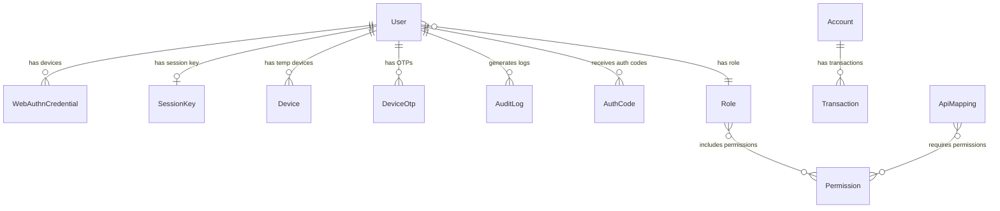

# 🗄️ Database Schema — NexusBank Zero Trust Platform

> Complete reference for all 13 MongoDB collections, their fields, indexes, relationships, and how they support the Zero Trust architecture.

---

## Overview

The application uses **MongoDB** with **Mongoose ODM**. All models are defined in the shared `@repo/db` package (`packages/db/src/models/`) and consumed by all three services.

```
┌─────────────────────────────────────────────────────────────────┐
│                        MongoDB Database                         │
│                      (zero-trust-db)                            │
├─────────────────────────────────────────────────────────────────┤
│                                                                 │
│  ┌──── Identity & Auth ─────┐  ┌──── Banking ───────────────┐  │
│  │  User                    │  │  Account                   │  │
│  │  Role                    │  │  Transaction               │  │
│  │  Permission              │  │                            │  │
│  │  AuthCode                │  └────────────────────────────┘  │
│  │  RefreshToken            │                                  │
│  └──────────────────────────┘  ┌──── Security ──────────────┐  │
│                                │  WebAuthnCredential        │  │
│  ┌──── Device Trust ────────┐  │  SessionKey                │  │
│  │  Device                  │  │  AuditLog                  │  │
│  │  DeviceOtp               │  │  ApiMapping                │  │
│  └──────────────────────────┘  └────────────────────────────┘  │
│                                                                 │
└─────────────────────────────────────────────────────────────────┘
```

---

## Collections

### User

The central identity document. Every user in the system has one.

| Field | Type | Required | Default | Description |
|-------|------|----------|---------|-------------|
| `_id` | ObjectId | Auto | — | MongoDB auto-generated ID |
| `email` | String | ✅ | — | Unique, lowercase, trimmed |
| `password` | String | ✅ | — | bcrypt hash (never plaintext) |
| `role` | String | ✅ | — | Role name (references `Role.name`) |
| `riskScore` | Number | ❌ | `0` | Behavioral risk score (0-100) |
| `disabled` | Boolean | ❌ | `false` | Admin can disable account |
| `isBlocked` | Boolean | ❌ | `false` | Auto-set when riskScore > 90 |
| `deleted` | Boolean | ❌ | `false` | Soft delete flag |
| `refreshToken` | String | ❌ | `null` | AES-256-CBC encrypted refresh JWT |
| `authenticatorSecret` | String | ❌ | `null` | TOTP secret for Google Authenticator |
| `isAuthenticatorSetup` | Boolean | ❌ | `false` | Has completed TOTP setup |
| `createdAt` | Date | Auto | — | Mongoose timestamp |
| `updatedAt` | Date | Auto | — | Mongoose timestamp |

**Indexes:** `email` (unique)

---

### Role

Dynamic role definitions with associated permissions.

| Field | Type | Required | Default | Description |
|-------|------|----------|---------|-------------|
| `_id` | ObjectId | Auto | — | — |
| `name` | String | ✅ | — | Unique role name (e.g., `"admin"`, `"teller"`) |
| `permissions` | [String] | ✅ | — | Array of permission names |

**Seeded Roles:**

| Role | Permissions |
|------|------------|
| `admin` | All 8 permissions |
| `manager` | All 8 permissions |
| `branch_manager` | All except `DELETE_ACCOUNT` |
| `loan_manager` | `READ_ACCOUNT`, `READ_TRANSACTION`, `CREATE_LOAN_TRANSACTION` |
| `teller` | `READ_ACCOUNT`, `CREATE_TRANSACTION`, `TRANSFER_MONEY` |
| `user` | `READ_TRANSACTION`, `READ_ACCOUNT`, `TRANSFER_MONEY` |

---

### Permission

Individual permission definitions.

| Field | Type | Required | Default | Description |
|-------|------|----------|---------|-------------|
| `_id` | ObjectId | Auto | — | — |
| `name` | String | ✅ | — | Permission name (e.g., `"READ_ACCOUNT"`) |
| `description` | String | ❌ | — | Human-readable description |

**Seeded Permissions:**

| Name | Description |
|------|-------------|
| `READ_TRANSACTION` | Can read transactions |
| `CREATE_TRANSACTION` | Can create transactions |
| `READ_ACCOUNT` | Can read account details |
| `TRANSFER_MONEY` | Can transfer money |
| `CREATE_ACCOUNT` | Can create user accounts |
| `EDIT_ACCOUNT` | Can edit user accounts |
| `DELETE_ACCOUNT` | Can delete user accounts |
| `CREATE_LOAN_TRANSACTION` | Can create loan transactions |

---

### AuthCode

One-time authorization codes used in the OAuth2 flow. Auto-deleted after expiry.

| Field | Type | Required | Default | Description |
|-------|------|----------|---------|-------------|
| `_id` | ObjectId | Auto | — | — |
| `code` | String | ✅ | — | 32-char hex code (unique) |
| `userId` | ObjectId | ✅ | — | References `User._id` |
| `redirectUri` | String | ✅ | — | Where to redirect after code exchange |
| `expiresAt` | Date | ✅ | — | 5 minutes from creation |
| `createdAt` | Date | Auto | — | — |

**Indexes:** `code` (unique), `expiresAt` (TTL — auto-deletes expired docs)

---

### RefreshToken

Dedicated refresh token collection (alternative to storing on User document).

| Field | Type | Required | Default | Description |
|-------|------|----------|---------|-------------|
| `_id` | ObjectId | Auto | — | — |
| `userId` | ObjectId | ✅ | — | References `User._id` |
| `token` | String | ✅ | — | The refresh token value |
| `expiresAt` | Date | ✅ | — | Token expiration |
| `createdAt` | Date | Auto | — | — |

> Note: The primary refresh token mechanism uses the `User.refreshToken` field (encrypted). This collection exists as an additional model.

---

### WebAuthnCredential

FIDO2/WebAuthn credentials bound to a user's physical device.

| Field | Type | Required | Default | Description |
|-------|------|----------|---------|-------------|
| `_id` | ObjectId | Auto | — | — |
| `userId` | ObjectId | ✅ | — | References `User._id` |
| `credentialId` | String | ✅ | — | WebAuthn credential ID (unique) |
| `publicKey` | String | ✅ | — | Base64url-encoded public key |
| `counter` | Number | ❌ | `0` | Monotonic counter (anti-clone detection) |
| `deviceName` | String | ❌ | `"Unknown Device"` | User-agent or custom name |
| `transports` | [String] | ❌ | `[]` | Transport types (e.g., `["internal"]`) |
| `createdAt` | Date | Auto | — | — |
| `updatedAt` | Date | Auto | — | — |

**Indexes:** `credentialId` (unique), `userId` (for fast lookup)

---

### SessionKey

Ephemeral ECDSA public keys for request signature verification.

| Field | Type | Required | Default | Description |
|-------|------|----------|---------|-------------|
| `_id` | ObjectId | Auto | — | — |
| `userId` | ObjectId | ✅ | — | References `User._id` |
| `publicKeyJWK` | String | ✅ | — | JSON-serialized JWK public key |
| `expiresAt` | Date | ✅ | — | 7 days from creation |
| `createdAt` | Date | Auto | — | — |
| `updatedAt` | Date | Auto | — | — |

**Indexes:** `expiresAt` (TTL — auto-deletes expired keys), `userId` (for fast lookup)

> Only one session key exists per user at any time. Registering a new key deletes all previous ones.

---

### Device

Temporary device sessions created during OTP-based new device login.

| Field | Type | Required | Default | Description |
|-------|------|----------|---------|-------------|
| `_id` | ObjectId | Auto | — | — |
| `userId` | ObjectId | ✅ | — | References `User._id` |
| `deviceId` | String | ✅ | — | Unique device identifier (random hex) |
| `deviceName` | String | ❌ | `"Unknown Device"` | From user-agent header |
| `isTrusted` | Boolean | ❌ | `false` | Set to `true` by admin approval |
| `expiresAt` | Date | ❌ | `null` | 5 hours for temp sessions; `null` for approved devices |
| `createdAt` | Date | Auto | — | — |
| `updatedAt` | Date | Auto | — | — |

**Indexes:** `deviceId` (unique)

---

### DeviceOtp

Temporary OTP records for device verification.

| Field | Type | Required | Default | Description |
|-------|------|----------|---------|-------------|
| `_id` | ObjectId | Auto | — | — |
| `userId` | ObjectId | ✅ | — | References `User._id` |
| `deviceId` | String | ✅ | — | Device being verified |
| `otp` | String | ✅ | — | 6-digit OTP code |
| `deviceName` | String | ❌ | `"Unknown Device"` | Device name |
| `expiresAt` | Date | ✅ | — | 10 minutes from creation |

---

### Account

Banking accounts.

| Field | Type | Required | Default | Description |
|-------|------|----------|---------|-------------|
| `_id` | ObjectId | Auto | — | — |
| `accountNumber` | String | ✅ | — | 10-digit random number (unique) |
| `ownerName` | String | ✅ | — | Account holder name |
| `balance` | Number | ✅ | `0` | Current balance |
| `currency` | String | ❌ | `"USD"` | Currency code |
| `type` | String | ❌ | `"CHECKING"` | One of: `CHECKING`, `SAVINGS`, `LOAN`, `BUSINESS` |
| `createdAt` | Date | Auto | — | — |
| `updatedAt` | Date | Auto | — | — |

**Indexes:** `accountNumber` (unique)

---

### Transaction

Banking transaction records.

| Field | Type | Required | Default | Description |
|-------|------|----------|---------|-------------|
| `_id` | ObjectId | Auto | — | — |
| `accountNumber` | String | ✅ | — | Associated account |
| `amount` | Number | ✅ | — | Transaction amount |
| `type` | String | ✅ | — | One of: `CREDIT`, `DEBIT`, `LOAN` |
| `description` | String | ❌ | `""` | Transaction description |
| `date` | Date | ❌ | `Date.now` | Transaction date |
| `createdAt` | Date | Auto | — | — |
| `updatedAt` | Date | Auto | — | — |

**Indexes:** `accountNumber` (for fast account-based queries)

---

### AuditLog

Immutable log of all authentication events.

| Field | Type | Required | Default | Description |
|-------|------|----------|---------|-------------|
| `_id` | ObjectId | Auto | — | — |
| `userId` | ObjectId | ✅ | — | References `User._id` (populated with email, role) |
| `action` | String | ✅ | — | One of: `login`, `logout`, `oauth_authorize`, `webauthn_login`, `webauthn_register` |
| `timestamp` | Date | ❌ | `Date.now` | When the event occurred |

---

### ApiMapping

Maps API routes to required permissions for dynamic RBAC.

| Field | Type | Required | Default | Description |
|-------|------|----------|---------|-------------|
| `_id` | ObjectId | Auto | — | — |
| `route` | String | ✅ | — | API route path (e.g., `/api/banking/accounts`) |
| `requiredPermissions` | [String] | ✅ | — | Permissions needed to access this route |

---

## Entity Relationships



---

## TTL Indexes (Auto-Deletion)

| Collection | Field | Effect |
|-----------|-------|--------|
| `AuthCode` | `expiresAt` | Auth codes auto-deleted after 5 minutes |
| `SessionKey` | `expiresAt` | Session keys auto-deleted after 7 days |

MongoDB's TTL monitor runs every 60 seconds and deletes documents where the indexed date field has passed.
