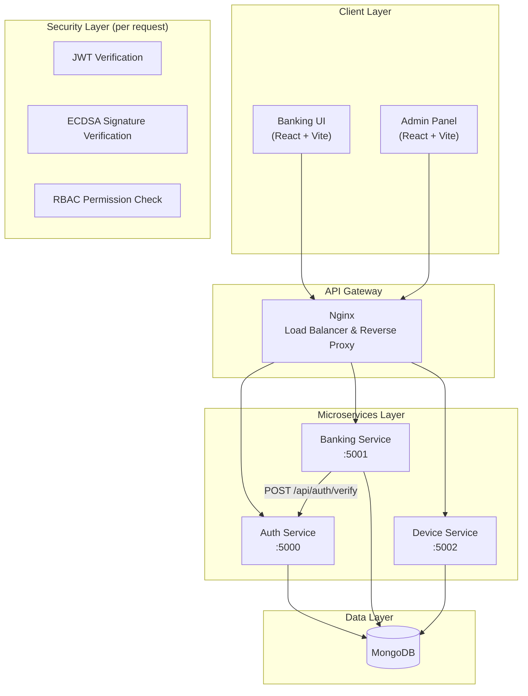
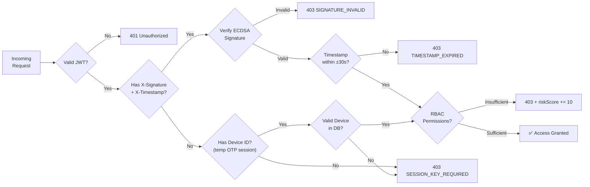
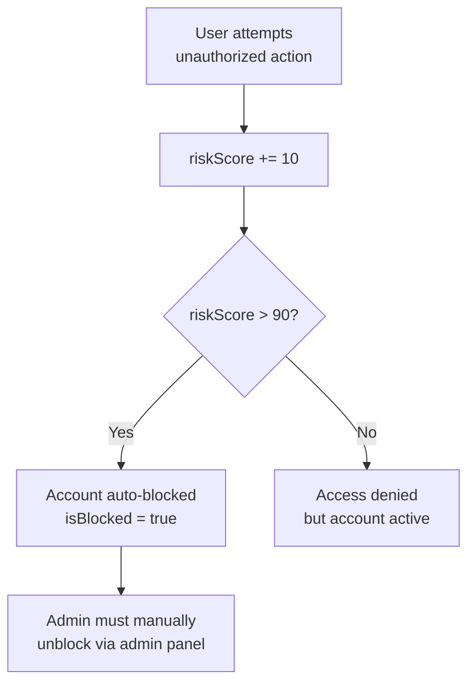
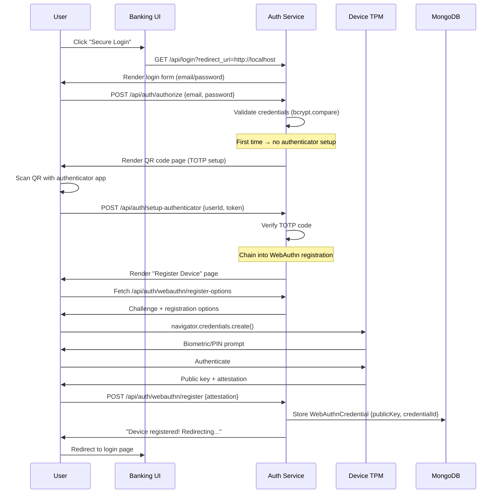
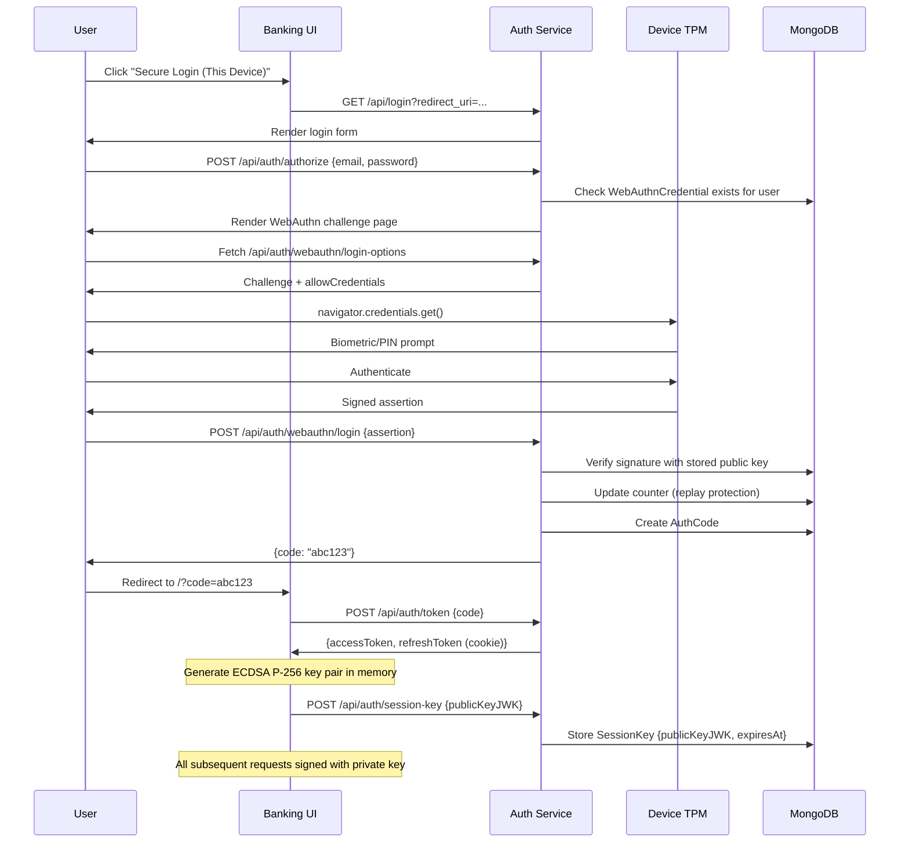
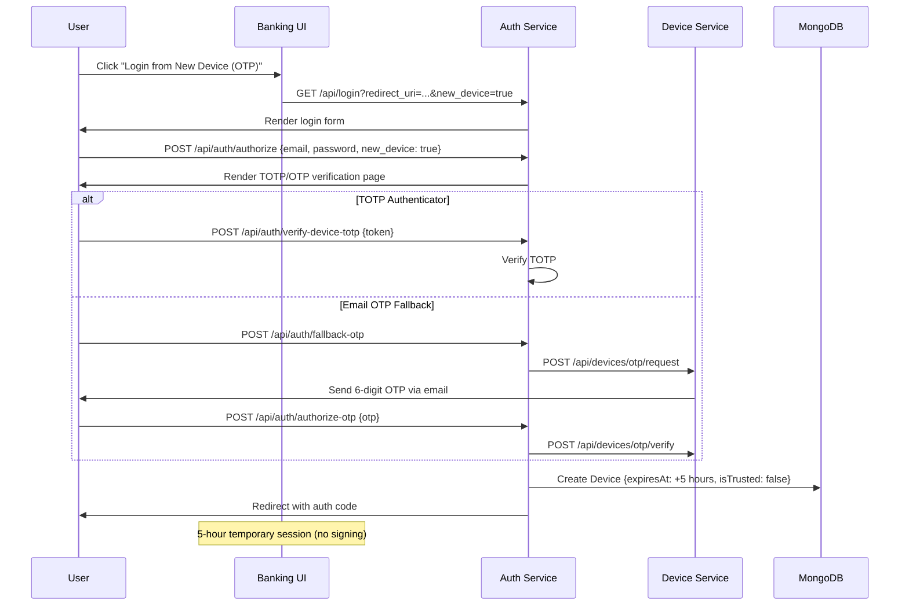
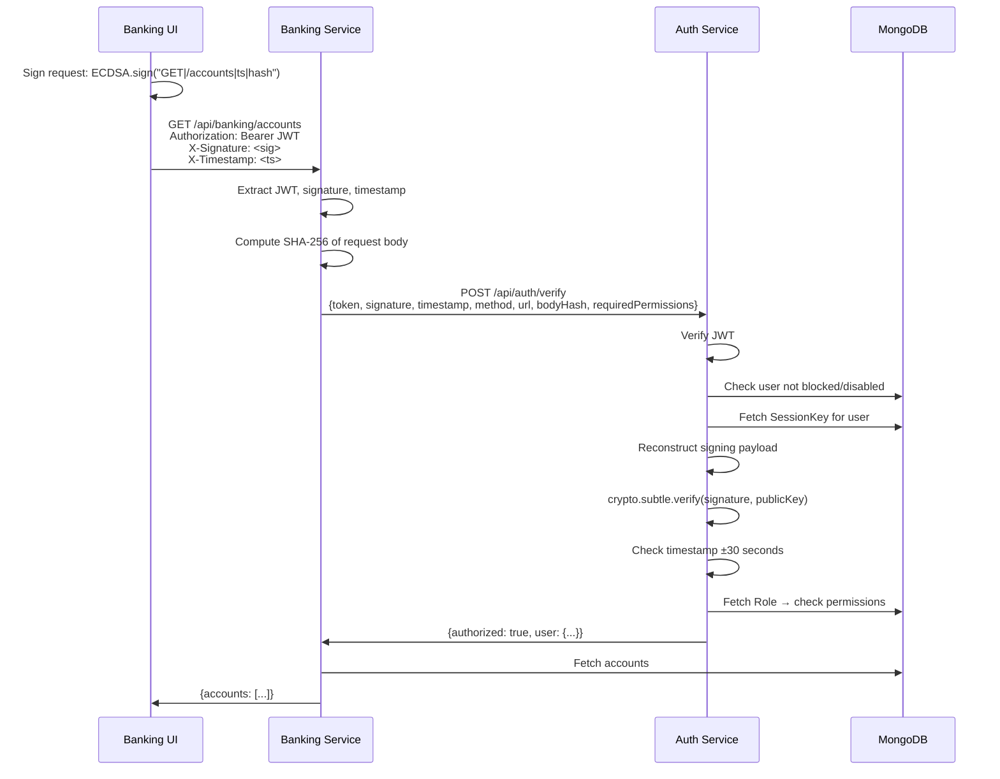
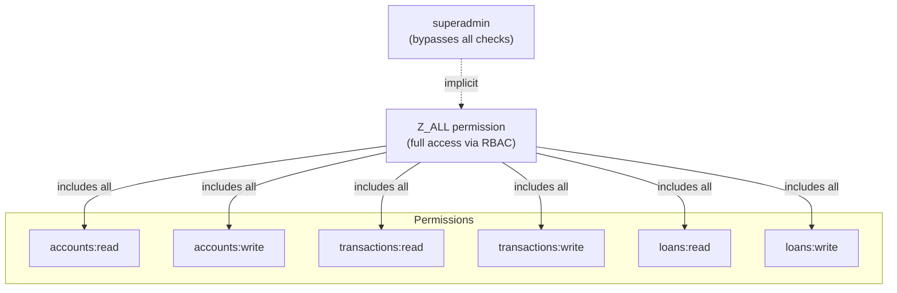

# Zero Trust Architecture Design for Enterprise Network
## Complete Project Report

---

## 1. Executive Summary

This project implements a **Zero Trust security architecture** for an enterprise banking system. The core principle is **"never trust, always verify"** — every request must cryptographically prove both **user identity** (JWT + MFA) and **device identity** (WebAuthn FIDO2 + per-request ECDSA signing).

The system uses **microservices architecture** with Docker containerization, Nginx load balancing, and MongoDB for persistence. It features a customer-facing banking application and an administrative control panel, both enforcing the same Zero Trust policies.

### Key Security Features
- **WebAuthn (FIDO2)** hardware-bound device verification using TPM/biometric
- **Per-request cryptographic signing** with ephemeral ECDSA P-256 session keys
- **Multi-Factor Authentication** via TOTP authenticator app + email OTP fallback
- **Dynamic RBAC** with permission-level granularity
- **Risk-based access control** with automatic blocking on suspicious activity
- **JWT + Refresh Token rotation** with encrypted token storage

---

## 2. System Architecture

### 2.1 High-Level Architecture



### 2.2 Monorepo Structure

```
Zero-Trust-Architecture/
├── services/
│   ├── auth/                    # Authentication, Authorization, WebAuthn
│   │   ├── controllers/
│   │   │   ├── auth.js          # Login, OAuth, token management
│   │   │   ├── admin.js         # User/Role/Permission CRUD
│   │   │   └── webauthn.js      # WebAuthn registration, login, session keys
│   │   ├── middleware/
│   │   │   └── authMiddleware.js # JWT verification, RBAC guards
│   │   └── routes/index.js
│   │
│   ├── banking/                 # Core banking operations
│   │   ├── middleware/
│   │   │   └── authorize.js     # Signature forwarding to auth service
│   │   └── index.js             # Accounts, transactions, loans
│   │
│   └── device-service/          # OTP management for new devices
│       └── src/index.ts         # Email OTP generation/verification
│
├── ui/
│   ├── banking-ui/              # Customer-facing React SPA
│   │   └── src/
│   │       ├── utils/
│   │       │   ├── api.js       # Axios + per-request signing
│   │       │   └── crypto.js    # ECDSA key generation + signing
│   │       └── pages/Login.jsx  # Dual-mode login (WebAuthn / OTP)
│   │
│   └── admin-panel/             # Admin React SPA
│       └── src/
│           ├── utils/
│           │   ├── api.js       # Axios + per-request signing
│           │   └── crypto.js    # ECDSA key generation + signing
│           └── pages/Login.jsx  # Dual-mode admin login
│
├── packages/
│   └── db/src/models/           # 13 Mongoose models (shared)
│
├── nginx/nginx.conf             # API Gateway configuration
├── docker-compose.yml           # Full stack orchestration
└── .env.example                 # Environment variable template
```

### 2.3 Technology Stack

| Layer | Technology | Purpose |
|-------|-----------|---------|
| **Frontend** | React 18, Vite | SPA with glassmorphism UI |
| **Backend** | Node.js, Express.js | RESTful microservices |
| **Database** | MongoDB, Mongoose | Document store with TTL indexes |
| **Gateway** | Nginx | Reverse proxy, load balancing |
| **Auth** | JWT, bcryptjs | Token-based authentication |
| **MFA** | otplib, qrcode | TOTP authenticator app |
| **Device Security** | @simplewebauthn/server | WebAuthn FIDO2 verification |
| **Request Signing** | Web Crypto API (ECDSA P-256) | Per-request cryptographic proof |
| **Email** | Nodemailer | OTP delivery for new devices |
| **DevOps** | Docker, Docker Compose | Containerization & orchestration |
| **Build** | pnpm, Turborepo | Monorepo workspace management |

---

## 3. Database Schema

### 3.1 Entity Relationship Diagram

```mermaid
erDiagram
    User ||--o{ WebAuthnCredential : "registers devices"
    User ||--o{ SessionKey : "has session keys"
    User ||--o{ Device : "temp OTP sessions"
    User ||--o{ Account : "owns"
    User ||--o{ AuditLog : "generates"
    User ||--o| RefreshToken : "has"
    Account ||--o{ Transaction : "contains"
    Role ||--o{ User : "assigned to"
    Permission ||--o{ Role : "included in"
    ApiMapping ||--o{ Permission : "requires"

    User {
        ObjectId _id
        String email UK
        String password
        String role
        Number riskScore
        Boolean isBlocked
        Boolean disabled
        Boolean deleted
        String refreshToken
        String authenticatorSecret
        Boolean isAuthenticatorSetup
    }

    WebAuthnCredential {
        ObjectId _id
        ObjectId userId FK
        String credentialId UK
        String publicKey
        Number counter
        String deviceName
        Array transports
    }

    SessionKey {
        ObjectId _id
        ObjectId userId FK
        String publicKeyJWK
        Date expiresAt TTL
    }

    Device {
        ObjectId _id
        ObjectId userId FK
        String deviceId UK
        String deviceName
        Boolean isTrusted
        Date expiresAt
    }

    Account {
        ObjectId _id
        ObjectId userId FK
        String accountType
        Number balance
    }

    Transaction {
        ObjectId _id
        ObjectId accountId FK
        String type
        Number amount
        Date date
    }

    Role {
        ObjectId _id
        String name UK
        Array permissions
    }

    Permission {
        ObjectId _id
        String name UK
        String description
    }

    ApiMapping {
        ObjectId _id
        String route UK
        Array requiredPermissions
    }

    AuditLog {
        ObjectId _id
        ObjectId userId FK
        String action
        Date timestamp
    }
```

### 3.2 All Collections (13 Total)

| Collection | Purpose | Key Fields |
|-----------|---------|------------|
| `users` | User accounts with credentials and risk scores | email, password, role, riskScore, isBlocked |
| `webauthn_credentials` | WebAuthn public keys bound to hardware | userId, credentialId, publicKey, counter |
| `session_keys` | Ephemeral ECDSA session public keys (TTL auto-delete) | userId, publicKeyJWK, expiresAt |
| `devices` | Temporary device sessions from OTP flow (5-hour TTL) | userId, deviceId, isTrusted, expiresAt |
| `device_otps` | Pending OTP codes for device verification | userId, deviceId, otp, expiresAt |
| `accounts` | Banking accounts (Checking, Savings, Loan) | userId, accountType, balance |
| `transactions` | Financial transaction records | accountId, type, amount |
| `roles` | RBAC role definitions | name, permissions[] |
| `permissions` | Individual permission definitions | name, description |
| `api_mappings` | Route-to-permission mapping | route, requiredPermissions[] |
| `auth_codes` | OAuth authorization codes (5-min TTL) | code, userId, redirectUri |
| `refresh_tokens` | Encrypted refresh tokens | userId, token, expiresAt |
| `audit_logs` | Security event log | userId, action, timestamp |

---

## 4. Security Architecture

### 4.1 Zero Trust Verification Chain

Every API request passes through this verification chain:



### 4.2 WebAuthn (FIDO2) Device Verification

WebAuthn provides **hardware-bound, cryptographic device identity** that cannot be copied, stolen via XSS, or intercepted via MITM.

**How it works:**

| Step | Where | What Happens |
|------|-------|-------------|
| 1. Registration | Device TPM/Secure Enclave | Generates asymmetric key pair. Private key **never leaves hardware**. |
| 2. Public key stored | MongoDB (`webauthn_credentials`) | Server stores public key + credential ID |
| 3. Login challenge | Auth Service → Browser | Server sends random challenge bytes |
| 4. Hardware signing | Device TPM | User authenticates with biometric/PIN. TPM signs challenge with private key. |
| 5. Verification | Auth Service | Server verifies signature using stored public key |

**Security properties:**

| Attack Vector | Protection |
|--------------|-----------|
| Cookie theft (DevTools) | No cookies — key is in hardware |
| XSS reads credentials | JavaScript cannot access private key |
| MITM interception | Challenge is unique per login; replaying fails |
| Device cloning | Private key is non-exportable from TPM |
| Credential stuffing | Requires physical device + biometric/PIN |

### 4.3 Per-Request Cryptographic Signing

After WebAuthn login, every API call is **cryptographically signed** using an ephemeral ECDSA P-256 key pair:

```
┌─────────────────────────────────────────────────────┐
│  Frontend (Browser Memory Only)                      │
│                                                      │
│  1. Generate ECDSA P-256 key pair                    │
│  2. Send public key to server                        │
│  3. For each request:                                │
│     payload = "POST|/api/banking/transfer|           │
│               1715280000000|a1b2c3d4e5f6..."         │
│     signature = ECDSA.sign(payload, privateKey)      │
│  4. Attach headers:                                  │
│     X-Signature: <base64url signature>               │
│     X-Timestamp: 1715280000000                       │
│                                                      │
│  ⚠️ Private key dies on page refresh/close           │
└─────────────────────────────────────────────────────┘
                        │
                        ▼
┌─────────────────────────────────────────────────────┐
│  Server (Auth Service verify endpoint)               │
│                                                      │
│  1. Fetch session public key from SessionKey DB      │
│  2. Reconstruct payload from request metadata        │
│  3. crypto.subtle.verify(signature, publicKey)       │
│  4. Check timestamp within ±30 seconds               │
│  5. If valid → proceed to RBAC check                 │
└─────────────────────────────────────────────────────┘
```

**Signing payload format:**
```
${HTTP_METHOD}|${URL_PATH}|${UNIX_TIMESTAMP_MS}|${SHA256_OF_REQUEST_BODY}
```

### 4.4 Multi-Factor Authentication

| Factor | Implementation | When |
|--------|---------------|------|
| **Knowledge** | Email + Password (bcrypt hashed) | Every login |
| **Possession** | TOTP Authenticator App (Google Authenticator, Authy) | First-time setup + new device verification |
| **Possession (fallback)** | Email OTP (6-digit, 5-min expiry) | When TOTP not available |
| **Inherence/Hardware** | WebAuthn biometric/PIN (TPM-bound) | Every login from registered device |

### 4.5 Risk-Based Access Control



---

## 5. Authentication & Authorization Flows

### 5.1 First-Time User Registration Flow



### 5.2 Returning Login (Registered Device)



### 5.3 New Device / OTP Fallback Login



### 5.4 Per-Request Authorization Flow



---

## 6. API Reference

### 6.1 Auth Service (`/api/auth`)

| Method | Endpoint | Auth | Description |
|--------|----------|------|-------------|
| GET | `/api/login` | None | Renders server-side login page |
| POST | `/api/auth/authorize` | None | Validates credentials, initiates MFA |
| POST | `/api/auth/setup-authenticator` | None | Verifies TOTP setup, chains to WebAuthn reg |
| POST | `/api/auth/verify-device-totp` | None | Verifies TOTP for new device |
| POST | `/api/auth/fallback-otp` | None | Requests email OTP for new device |
| POST | `/api/auth/authorize-otp` | None | Verifies email OTP |
| POST | `/api/auth/token` | None | Exchanges auth code for JWT |
| POST | `/api/auth/verify` | Internal | Centralized JWT + signature + RBAC verification |
| POST | `/api/auth/refresh` | Cookie | Rotates access + refresh tokens |
| POST | `/api/auth/logout` | JWT | Clears session |
| POST | `/api/auth/login` | None | Legacy direct login (admin panel) |

### 6.2 WebAuthn Endpoints (`/api/auth/webauthn`)

| Method | Endpoint | Auth | Description |
|--------|----------|------|-------------|
| POST | `/api/auth/webauthn/register-options` | None | Generates WebAuthn registration challenge |
| POST | `/api/auth/webauthn/register` | None | Verifies attestation, stores credential |
| POST | `/api/auth/webauthn/login-options` | None | Generates WebAuthn authentication challenge |
| POST | `/api/auth/webauthn/login` | None | Verifies assertion, issues auth code |
| POST | `/api/auth/session-key` | JWT | Stores ephemeral session public key |

### 6.3 Admin Endpoints (`/api/admin`)

| Method | Endpoint | Auth | Description |
|--------|----------|------|-------------|
| GET | `/api/admin/users` | JWT + RBAC | List all users |
| POST | `/api/admin/users` | JWT + RBAC | Create user |
| PATCH | `/api/admin/users/:id/role` | JWT + RBAC | Update user role |
| POST | `/api/admin/users/disable` | JWT + RBAC | Disable/enable user |
| PATCH | `/api/admin/users/risk` | JWT + RBAC | Adjust risk score |
| GET | `/api/admin/roles` | JWT + RBAC | List roles |
| POST | `/api/admin/roles` | JWT + RBAC | Create role |
| GET | `/api/admin/permissions` | JWT + RBAC | List permissions |
| POST | `/api/admin/permissions` | JWT + RBAC | Create permission |
| GET | `/api/admin/audit-logs` | JWT + RBAC | View audit logs |

### 6.4 Banking Endpoints (`/api/banking`)

| Method | Endpoint | Auth | Permissions Required |
|--------|----------|------|---------------------|
| GET | `/api/banking/accounts` | JWT + Signature | `accounts:read` |
| POST | `/api/banking/accounts` | JWT + Signature | `accounts:write` |
| GET | `/api/banking/transactions/:id` | JWT + Signature | `transactions:read` |
| POST | `/api/banking/transaction` | JWT + Signature | `transactions:write` |
| POST | `/api/banking/loan` | JWT + Signature | `loans:write` |

### 6.5 Device Service (`/api/devices`)

| Method | Endpoint | Auth | Description |
|--------|----------|------|-------------|
| GET | `/api/devices` | JWT | List registered devices |
| POST | `/api/devices/otp/request` | Internal | Generate and email OTP |
| POST | `/api/devices/otp/verify` | Internal | Verify OTP, create device session |
| PATCH | `/api/devices/:id/approve` | JWT | Admin: approve device (permanent trust) |
| PATCH | `/api/devices/:id/revoke` | JWT | Admin: revoke device |

---

## 7. RBAC (Role-Based Access Control)

### 7.1 Permission Hierarchy



### 7.2 Dynamic API Mapping

Routes are mapped to permissions via the `ApiMapping` collection. This allows **runtime permission changes** without code deployment:

```json
{
  "route": "GET:/api/banking/accounts",
  "requiredPermissions": ["accounts:read"]
}
```

---

## 8. Infrastructure

### 8.1 Docker Compose Services

| Service | Port | Replicas | Purpose |
|---------|------|----------|---------|
| `nginx` | 80 | 1 | API Gateway + Load Balancer |
| `auth-service` | 5000 | scalable | Authentication, Authorization, WebAuthn |
| `banking-service` | 5001 | scalable | Banking operations |
| `device-service` | 5002 | scalable | OTP management |
| `banking-ui` | 80 | 1 | Customer frontend |
| `admin-ui` | 80 | 1 | Admin frontend |
| `mongodb` | 27017 | 1 | Database |

### 8.2 Horizontal Scaling

```bash
# Scale auth service to 3 replicas
docker-compose up --scale auth-service=3 -d

# Scale banking service to 3 replicas
docker-compose up --scale banking-service=3 -d
```

Nginx automatically load-balances across all replicas using round-robin.

### 8.3 Environment Variables

| Variable | Service | Purpose |
|----------|---------|---------|
| `MONGO_URI` | All | MongoDB connection string |
| `JWT_SECRET` | Auth | JWT signing secret |
| `REFRESH_SECRET` | Auth | Refresh token signing secret |
| `SUPERADMIN_EMAIL` | Auth | Default superadmin email |
| `SUPERADMIN_PASSWORD` | Auth | Default superadmin password |
| `WEBAUTHN_RP_NAME` | Auth | WebAuthn Relying Party display name |
| `WEBAUTHN_RP_ID` | Auth | WebAuthn domain identifier |
| `WEBAUTHN_ORIGIN` | Auth | Expected origin for WebAuthn verification |
| `EMAIL_USER` | Device | SMTP email for OTP delivery |
| `EMAIL_PASS` | Device | SMTP app password |
| `AUTH_VERIFY_URL` | Banking | URL to auth service verify endpoint |
| `CORS_ORIGINS` | All | Allowed CORS origins |

---

## 9. Security Comparison

### 9.1 Before vs After WebAuthn Implementation

| Aspect | Before (Cookie-based) | After (WebAuthn + Signing) |
|--------|----------------------|---------------------------|
| Device identity | UUID string in cookie | Hardware-bound key in TPM |
| Proof mechanism | Client sends a string | Cryptographic signature |
| Copyable? | Yes (DevTools → copy) | No (private key in hardware) |
| XSS vulnerable? | Yes (not HttpOnly) | No (JS can't access private key) |
| MITM vulnerable? | Partially (if no HTTPS) | No (unique challenge per login) |
| Per-request verification | None | ECDSA signature on every call |
| Superadmin bypass | Yes (skipped all device checks) | No (all users verified equally) |
| Session persistence | 1-year cookie | Memory only (dies on refresh) |
| Replay protection | None | Timestamp ±30s + counter |
| Cost | Free | Free (Web Standards) |

### 9.2 Attack Resistance Matrix

| Attack | Cookie System | WebAuthn + Signing |
|--------|--------------|-------------------|
| Stolen JWT used from another machine | ✅ Works (just copy the cookie too) | ❌ Blocked (no private key) |
| XSS steals device identity | ✅ `document.cookie` readable | ❌ Private key not in JS |
| Physical access to unlocked device | ✅ Copy cookie in 5 seconds | ⚠️ Requires biometric/PIN |
| Man-in-the-Middle | ⚠️ Cookie visible without HTTPS | ❌ Challenge-response is unique |
| Session replay attack | ✅ Same cookie works forever | ❌ Timestamp + counter validation |
| Cross-site request forgery | ⚠️ Cookie sent automatically | ❌ Signature can't be forged |

---

## 10. Running the Project

### Prerequisites
- Docker and Docker Compose installed
- pnpm (for local development)

### Quick Start
```bash
# Clone the repository
git clone <repo-url>
cd Zero-Trust-Architecture-Design-for-Enterprise-Network

# Set up environment
cp .env.example .env
# Edit .env with your MongoDB URI

# Build and run
docker-compose up --build
```

### Access Points
| Application | URL |
|------------|-----|
| Banking UI | http://localhost/ |
| Admin Panel | http://localhost/admin |
| Auth API | http://localhost/api/auth/ |
| Banking API | http://localhost/api/banking/ |

### Default Admin Credentials
```
Email:    admin@gmail.com
Password: admin@123
```
> On first login, admin goes through the same TOTP + WebAuthn setup as all users.

---

## 11. Audit & Compliance

All security-relevant events are logged in the `audit_logs` collection:

| Action | When Logged |
|--------|------------|
| `login` | Successful credential authentication |
| `logout` | User-initiated session termination |
| `oauth_authorize` | OAuth authorization code issued |
| `webauthn_login` | Successful WebAuthn device authentication |
| `webauthn_register` | New WebAuthn device credential registered |

Risk scores are tracked per-user and auto-increment on unauthorized access attempts. Accounts are automatically blocked when `riskScore > 90`.

---

*Report generated for Zero Trust Architecture Design for Enterprise Network — May 2026*
