# 👤 User Flows — NexusBank Zero Trust Platform

> Every user journey mapped out step by step. This covers what actually happens at each stage — from the first login to daily banking operations.

---

## Table of Contents

- [Flow 1: First-Time User Login (Complete Onboarding)](#flow-1-first-time-user-login)
- [Flow 2: Returning User Login (Registered Device)](#flow-2-returning-user-login-registered-device)
- [Flow 3: New Device Login (OTP Fallback)](#flow-3-new-device-login-otp-fallback)
- [Flow 4: Device Revoked by Admin](#flow-4-device-revoked-by-admin)
- [Flow 5: Making a Banking API Call](#flow-5-making-a-banking-api-call)
- [Flow 6: Session Expiry & Token Refresh](#flow-6-session-expiry--token-refresh)
- [Flow 7: Page Refresh Behavior](#flow-7-page-refresh-behavior)
- [Flow 8: Admin Panel Operations](#flow-8-admin-panel-operations)
- [Flow 9: Superadmin Creates a New Employee](#flow-9-superadmin-creates-a-new-employee)
- [Flow 10: User Gets Blocked (Risk Score)](#flow-10-user-gets-blocked)

---

## Flow 1: First-Time User Login

This is the complete onboarding flow when a user has never logged in before. It involves setting up TOTP and registering a WebAuthn device.

```mermaid
flowchart TD
    A["User opens http://localhost"] --> B["Redirected to /login page"]
    B --> C["Clicks 'Login' → Redirected to auth service<br/>/api/login?redirect_uri=http://localhost"]
    C --> D["Server renders login form"]
    D --> E["User enters email + password"]
    E --> F{"POST /api/auth/authorize"}
    
    F --> G{"Is authenticator<br/>set up?"}
    G -->|"No (first time)"| H["Server generates TOTP secret<br/>Renders QR code page"]
    H --> I["User scans QR with<br/>Google Authenticator app"]
    I --> J["User enters 6-digit TOTP code"]
    J --> K{"POST /api/auth/setup-authenticator"}
    K --> L{"Is TOTP valid?"}
    L -->|"No"| M["Error: Invalid code. Try again."]
    L -->|"Yes"| N["isAuthenticatorSetup = true<br/>Renders WebAuthn registration page"]
    
    N --> O["User clicks 'Register Device'"]
    O --> P["Browser prompts for<br/>biometric/PIN via WebAuthn API"]
    P --> Q{"POST /api/auth/webauthn/register"}
    Q --> R["Credential stored in<br/>WebAuthnCredential collection"]
    R --> S["'Device registered!<br/>Redirecting to login...'"]
    S --> T["User redirected back to<br/>http://localhost<br/>(must login again to get tokens)"]
    
    T --> U["User goes through login again"]
    U --> V["This time: authenticator IS set up<br/>AND WebAuthn creds exist"]
    V --> W["Server renders WebAuthn<br/>verification page"]
    W --> X["User verifies with biometric/PIN"]
    X --> Y["Auth code generated → redirect"]
    Y --> Z["Code exchanged for tokens"]
    Z --> AA["Session key generated in memory"]
    AA --> AB["✅ User is fully logged in"]
    
    style AB fill:#10b981,color:#fff
    style M fill:#ef4444,color:#fff
```

### What gets created during this flow:

| Step | What's Created | Where |
|------|---------------|-------|
| TOTP Setup | `authenticatorSecret` on User document | MongoDB |
| WebAuthn Registration | `WebAuthnCredential` document | MongoDB |
| Login | `AuthCode` (one-time, 5-min TTL) | MongoDB |
| Token Exchange | `accessToken` (15-min JWT) | Browser `localStorage` |
| Token Exchange | `refreshToken` (7-day JWT, encrypted) | HttpOnly cookie + User document |
| Session Key | ECDSA key pair (P-256) | Browser memory (private), MongoDB (public) |

---

## Flow 2: Returning User Login (Registered Device)

The fast path — user has already set up TOTP and has a registered WebAuthn device.

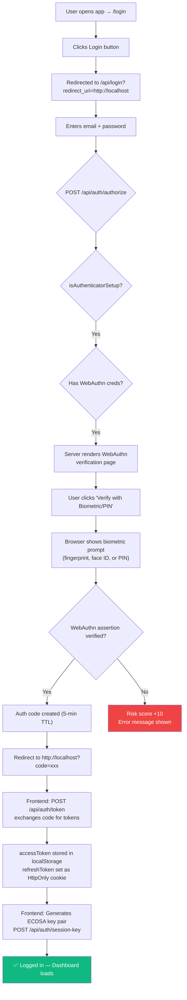

**Time to login:** ~5 seconds (password + one biometric touch)

---

## Flow 3: New Device Login (OTP Fallback)

When a user logs in from a device they haven't registered (or when they choose "Use different device").

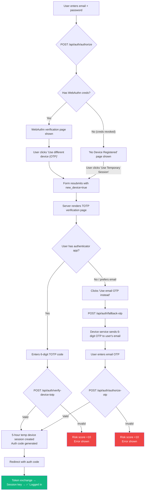

### Important limitations of the temporary session:

| Aspect | Registered Device | Temporary Session |
|--------|------------------|-------------------|
| Duration | Until token expires (7 days) | **5 hours** |
| Trust Level | `isTrusted: true` (after admin approval) | `isTrusted: false` |
| Device Record | Permanent | Expires after 5 hours |
| Re-login Required | Only when tokens expire | Every 5 hours |

---

## Flow 4: Device Revoked by Admin

When an admin revokes a user's WebAuthn device from the admin panel.

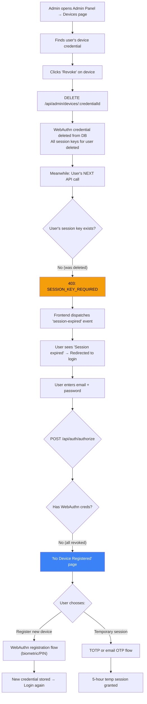

---

## Flow 5: Making a Banking API Call

What happens behind the scenes on every single API request after login.

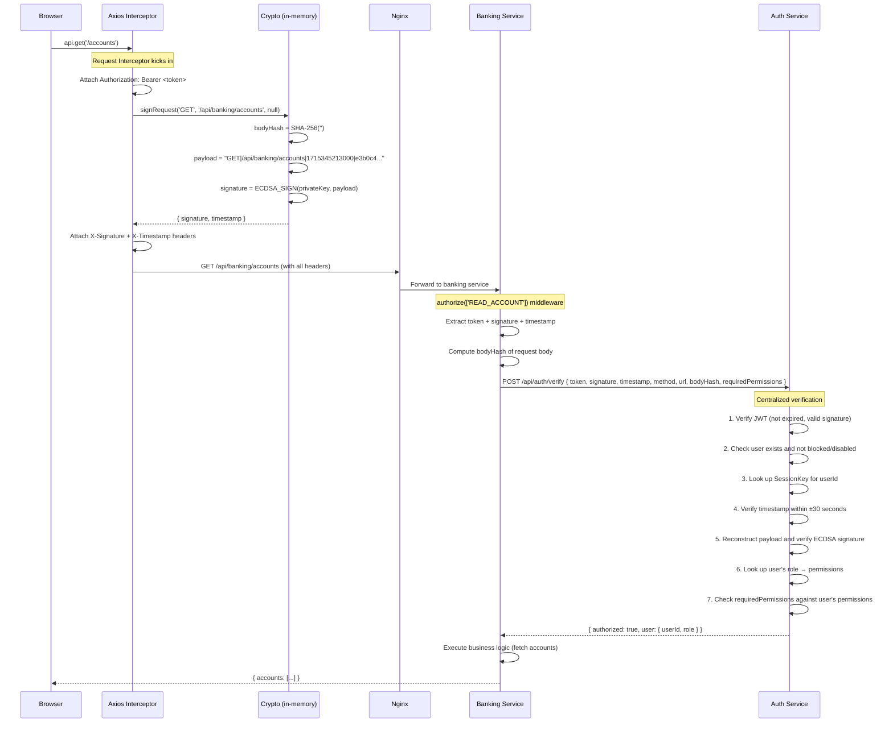

---

## Flow 6: Session Expiry & Token Refresh

The access token expires every 15 minutes. Here's what happens automatically.

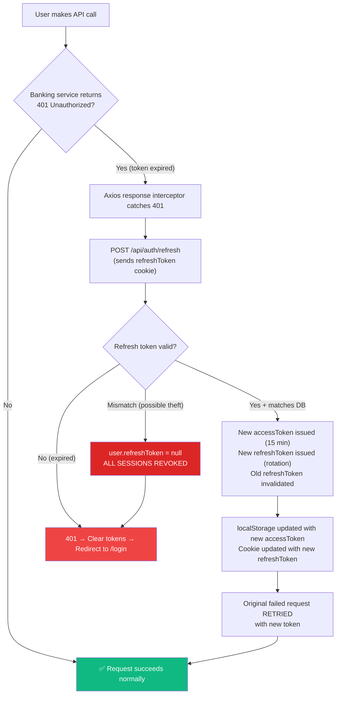

---

## Flow 7: Page Refresh Behavior

This is unique to this architecture — **refreshing the page kills the session key**.

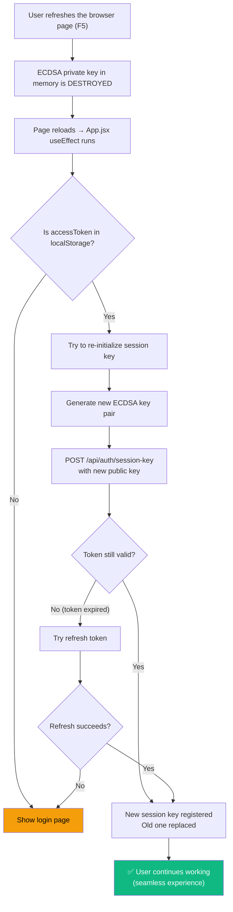

> The page refresh is handled gracefully — if the access token (or refresh token) is still valid, the user doesn't need to re-login. A new session key is silently registered.

---

## Flow 8: Admin Panel Operations

### Managing Users

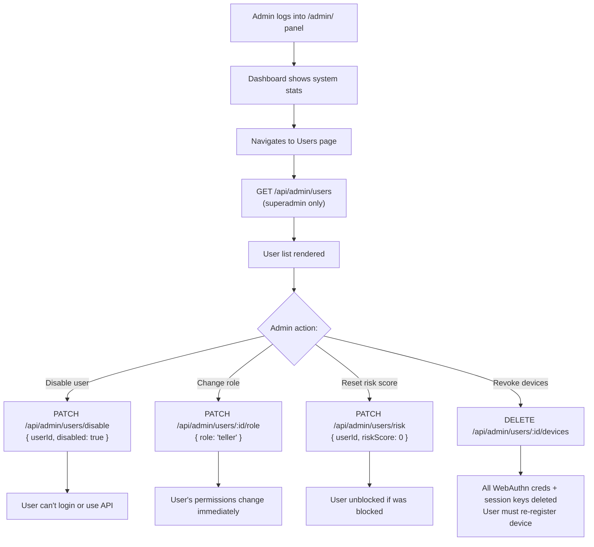

### Managing Roles & Permissions

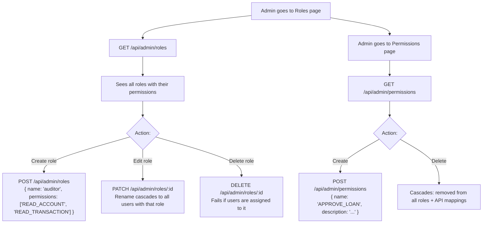

---

## Flow 9: Superadmin Creates a New Employee

End-to-end flow of adding a new bank employee to the system.

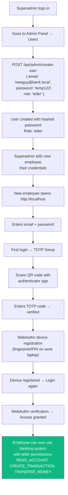

---

## Flow 10: User Gets Blocked

The system automatically blocks users who exhibit suspicious behavior.

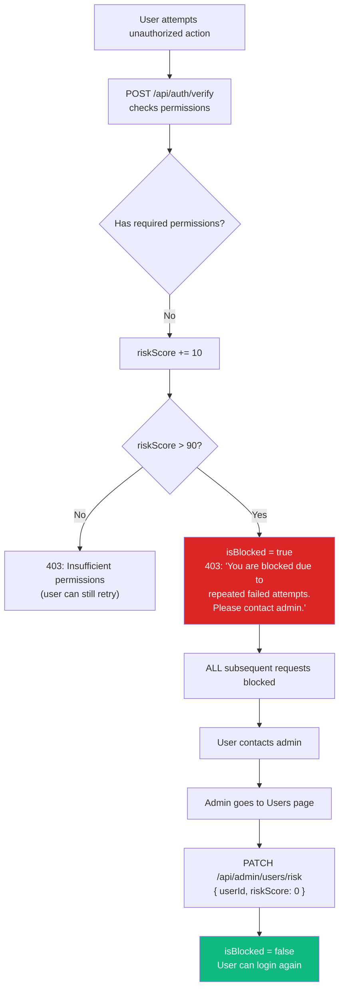

### What increases risk score:

| Action | Score Increase |
|--------|---------------|
| Failed permission check | +10 |
| Failed TOTP verification (new device) | +10 |
| Failed email OTP verification | +10 |
| Failed WebAuthn assertion | +10 |
| **Auto-block threshold** | **> 90** |

---

## Quick Reference: All User States

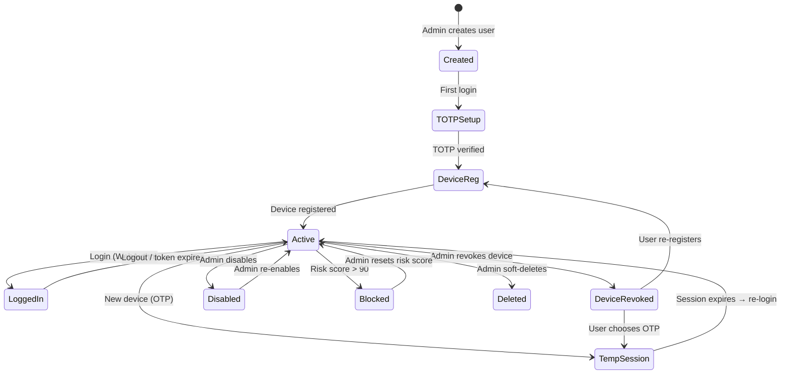
