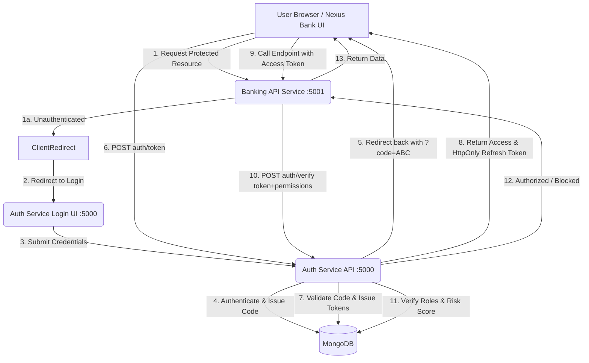

# Nexus Bank & Zero-Trust Authentication Architecture
**Upgraded System Documentation**

This documentation covers the newly upgraded Authentication and Authorization architecture and how the newly built Banking app integrates with it.

---

## 🏗 1. Architecture Overview



---

## 🔐 2. Authentication Flow (OAuth2 Inspired)

The authentication process strictly separates the identity provider from the consumer services:

1. **Authorization Request:** Client app redirects user to `http://localhost:5000/api/login?redirect_uri=...`
2. **Authentication:** The Auth service renders an HTML login. User submits credentials to `POST /api/auth/authorize`.
3. **Authorization Code Issuance:** Upon success, a short-lived random `code` is saved in the database referencing the user, and user is redirected back to `redirect_uri?code=...`
4. **Token Exchange:** The frontend exacts the `code` and calls `POST /api/auth/token`.
5. **Token Issuance:** The Auth Service ensures the code is valid. It responds with:
   - `accessToken` (Short-lived, e.g. 15 mins) as a JSON response.
   - `refreshToken` (Long-lived, Hash stored in DB) sent securely as an `HttpOnly` Set-Cookie header.

---

## 🛡 3. Authorization Flow & Risk-Based Security

### How the Middleware Works
The Banking Application `authorize(requiredPermissions)` middleware enforces Security via RPC to the Auth Service.
1. Intercepts incoming requests.
2. Extracts Bearer Access Token.
3. Rapidly forwards Token and `requiredPermissions` array to `POST /api/auth/verify`.
4. Decides to allow the request to proceed downstream or yield a 401/403.

### How Permissions are Validated + Zero-Trust Engine
The Auth Service extracts `role` from the token and verifies it against the DB `Role` map dynamically.
1. Finds user role and lists its absolute `permissions`.
2. Validates if the required permissions intersect.

### 🚨 Risk-Based Logic
- If a user passes the Access Token sanity check but falls short on specific endpoint permissions (e.g., trying to access Admin endpoints with a User Token).
- Authentication service intercepts the unauthorized action.
- Increments `riskScore` by **10** points for the User account.
- If `riskScore` exceeds **90**, the user state flags `isBlocked = true`.
- Once blocked, future Logins and Verifications will strictly return **403 Access Denied**. 

---

## 🔌 4. API Documentation

### Auth Service APIs (`:5000/api/auth`)

* **`GET /login?redirect_uri={URI}`**
  - Renders HTML login page.
* **`POST /auth/authorize`**
  - Body: `{ email, password, redirect_uri }`
  - Validates credentials and replies with a 302 Redirect bearing a `code`.
* **`POST /auth/token`**
  - Body: `{ code }`
  - Returns `accessToken: JWT` and sets HttpOnly cookie for `refreshToken`.
* **`POST /auth/verify`**
  - Body: `{ token: "jwt..", requiredPermissions: ["READ_TRANSACTION"] }`
  - Returns: `{ authorized: true/false, user: { userId, role } }`.
  - Can throw *User Blocked* or *Insufficient Permissions* errors upon threshold triggers.

### Banking Service APIs (`:5001/api`)
All endpoints demand valid `Authorization: Bearer <accessToken>`.

* **`GET /transactions`** - Requires: `['READ_TRANSACTION']`
  - Returns a list of the user's mocked transaction histories.
* **`POST /transactions`** - Requires: `['CREATE_TRANSACTION']`
  - Body: `{ amount, type }`
  - Simulates creating a transaction entry.
* **`GET /account`** - Requires: `['READ_ACCOUNT']`
  - Returns Mock Account details and current balance string.
* **`POST /transfer`** - Requires: `['TRANSFER_MONEY']`
  - Body: `{ expectedAmount, destination }`
  - Mutates system states to withdraw the transferred balance properly.

---

## 🗄 5. Database Schema Additions

### User Schema Modification
Added `isBlocked`: boolean threshold lock.
```javascript
  isBlocked: { type: Boolean, default: false } // Blocks account indefinitely once riskScore > 90
```

### AuthCode Model
Temporary transit code map.
```javascript
{
  code: String (unique),
  userId: ObjectId,
  redirectUri: String,
  expiresAt: Date (TTL Indexed 5 mins)
}
```

### RefreshToken Model
Persistent scalable backend session states.
```javascript
{
  tokenHash: String, // bcrypt hashed hash to prevent leaks
  userId: ObjectId,
  expiresAt: Date, // TTL Indexed 7 days
  isRevoked: Boolean
}
```

---

## 🛠 6. Extensibility Guidelines

#### Add New Roles
Simply run a seed update or invoke `/api/admin/roles` API to create a new Role document mapping to permission strings like `MANAGER`.

#### Add New Permissions
1. Create Permission document (e.g. `['DELETE_TRANSACTION']`).
2. Add the permission string ID to specific `Roles` mapping arrays.
3. Update endpoints relying on it: `app.delete('/transactions', authorize(['DELETE_TRANSACTION']), ...)`

#### Add New APIs
- Provision the standard endpoint in `services/banking/index.js`.
- Secure it rigidly via the `authorize([...])` middleware immediately.
- Frontend App can ping it simply leveraging `apiCall('/endpoint')` wrapper.
